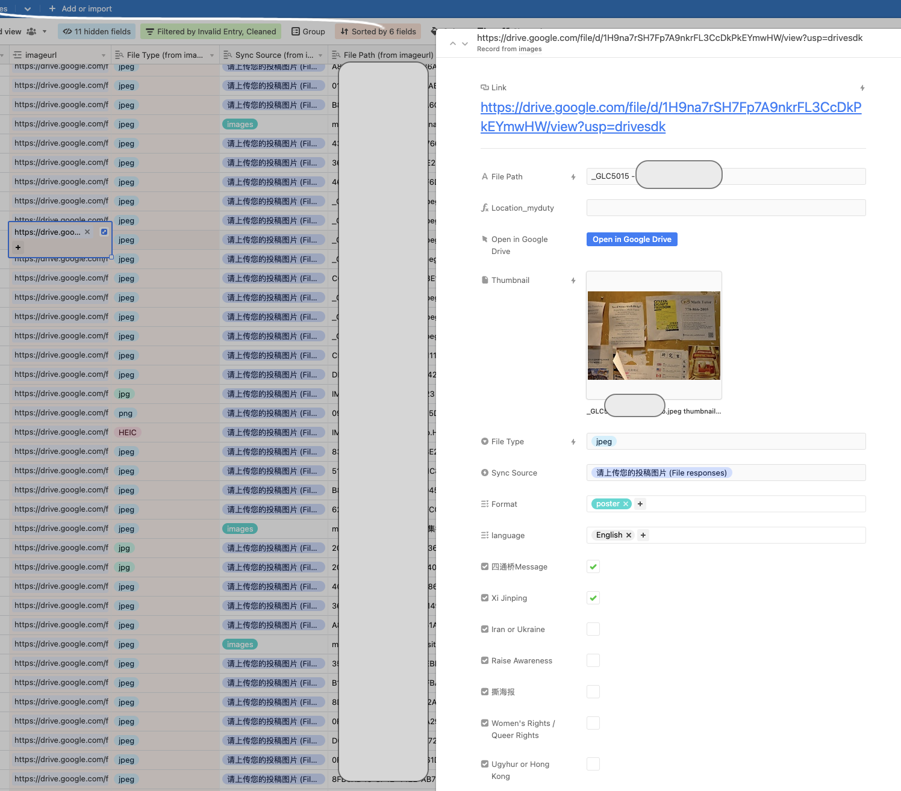

# Data 
## Goal
There are a lot of efforts to collect and share information about the movement, but almost all of them are trapped in social media applications like Twitter feeds or Instagram stories. Social media are easy to share and to gauge momentum during a political movement, but are not in a usable format for visualization and research.

I hope to create a data collection and data cleaning workflow that achieves the following goals -

1) Create a queryable version of the poster image dataset that can be easily manipulated in a dataframe;

  - A unique ID should be created to link the image file to other features;
  - Manually entered fields (e.g. locations) should be standardized;
  - Features created (e.g. what the poster is about) should be easily queryable.
  
2) Create a reproducible workflow that allows me to continuously scrape, clean and maintain this dataset.

3) Sharing this dataset on GitHub will not cause an privacy risk for protest participants.

```{r}
knitr::include_graphics("image/visual3.png")
```

## Data Collection
### Instagram pages
The phenomenon of overseas Chinese protestors using Instagram to distribute information and organize protests is well documented in mainstream media ([Wired](Instagram accounts that have been considered central information hubs for the protest) and [NYTimes](https://www.nytimes.com/2022/10/24/business/xi-jinping-protests.html)). Most notably, [@northern_square](https://www.instagram.com/northern_square/) and [@citizendailycn](https://www.instagram.com/citizensdailycn/?hl=en) can be pinpointed as the central hub of information. In an interview with Wired, Bei, a New York based artist who manages [@northern_square](https://www.instagram.com/northern_square/) described that his followers would put up the same slogan in their cities in solidarity with the Sitong Bridge protester, and then submitting the pictures to Bei. During the height of the movement, he would receive hundreds of submissions a day.

To collect information shared by those two accounts, I first convert their Instagram pages into `JSON` format by adding the query string `?__a=1&__d=dis` to their Instagram profile's `HTML` address. Then the `JSON` can be downloaded to a local file, which I parsed using `scripts/instagram_scraper.py`. The output of the scraper is a `.csv` file containing metadata information of the images scraped, as well as the image files, connected by a unique `filename` field.

The results scraped from the Instagram pages only includes the image themselves and the post caption, and does not include any information with regard to who submitted the image or where the picture was taken. However, due to the curated nature of the post, this dataset includes some of the most compelling graphics -

```{r}
knitr::include_graphics("image/visual5.png")
```

### Community Maintained Website
[myduty.net](myduty.net) is a spin off of [@citizendailycn](https://www.instagram.com/citizensdailycn/?hl=en), built and maintained by community members, which collects and displays poster sightings from anonymous submissions. I built a simple scraper `scripts/website_scraper.py` using python's `BeautifulSoup` package. The output of the scraper is a `.csv` file containing metadata information of the images scraped, as well as the image files, connected by a unique `filename` field.

The results scrapped from the website does not include information about the submitter, but does include the location of the poster. 

### Goolge Form
A Google form is distributed to followers of [@northern_square](https://www.instagram.com/northern_square/) to submit sightings of poster or their own posters, which collects both pictures of the poster and a brief survey on submitter demographics. The form is also distributed in protesters' Telegram groups, which is then passed through `scripts/form_data_cleaner.py` for basic data cleaning.

```{r, fig.cap = "@northern_square calling for followers to submit their posters through Google form"}
knitr::include_graphics("image/visual4.png")
```


## Data Cleaning

By the end of November, I have collected 734 image files from the Google form, 360 image files scraped from `myduty.net`, and 151 scraped from both Instagram accounts. There are a lot of data quality issues associated with the data set:

- Location data are entered by the submitter, thus requires manual cleaning before we can use `Geopy` to standardize;
- Google automatically pulls the username of the form submitter to name the file they uploaded; 
- Duplicate submissions exist;
- Some submissions or scrapped content are not pictures of posters (e.g. other Instagram posts, spams, etc);
- Image data requires manual tagging to extract queryable information;
- Image data contains EXIF data, which includes camera information and occasionally detailed GPS location of where the picture was taken;
- Some submissions include personally identifiable information.

To account for the above issues, I loaded the images and metadata files into Airtable to leverage its interactive format for data tagging and cleaning. 

```{r, fig.cap="Airtable data tagging interface. File Path blocked since it includes the Gmail user name of the submitter"}

```

This set up allows me go through every submission to add features and standardize text fields. New entries to the database will be automatically added to the end of the queue.

### New columns created

- `message` - what is the message the protester is trying to express?
	- The Sitong Bridge slogan, or variation of the slogan
	- Directly addressing Xi Jinping
	- Calling for woman's rights and / or queer rights 
	- Calling for solidarity with foreign anti-authoritarian movement in Iran or Russian
	- Calling for solidarity with domestic anti-authoritarian movement in Hong Kong or by Uyghurs
	- Included detailed explanation of the event background to raise awareness for what is going on in China

- `format` - what is the form of the expression? 
  - Poster
  - Graffiti
  - Handwritten message (often added as a response to the poster)
  - Chalk

- `language used` - What is the language used in the submission?
  - English
  - Chinese
  - etc.
  
### Columns updated
- Location
  - The location field submitted from Google form or parsed from `myduty.net` are manually cleaned to be more recognizable by geocoding services
    - e.g. "Downstairs cafeteria in UCLA student center" will be updated to "UCLA"
  - When location is not submitted but can be inferred from the image via landmarks or other information (e.g. school name on a neighboring poster), location is manually populated.
  - A boolean field is added to check if the location is on a University campus

### Row Removal Criteria
- Repeated submissions;
- Submissions outside of time range;
  - e.g. a set of photography documenting 2019's Hong Kong protests
- Posts scrapped from @northern_square and @citizendaily_cn that are not relevant to the poster movement;
- Submissions have personally identifiable information.

## Transformation and Result

In the last step, the cleaned files are pulled through Airtable API back into Python for final cleaning. The cleaning script `script/EDA_data_cleaning` achieves the following functionalities -

- The cleaned location field are geocoded using `Geopy`, and are parsed into `Latitude`, `Longtitude` and `Country`;
- The tagged features (messages, languages, formats) were stored in Airtable as lists, which are parsed into seperate columns of boolean values;
- A unique identifier `filename` is created to link the features with images;
- EXIF data on each image are removed.

The final output of data cleaning has 692 unique entries and 40 columns, 30 of which are boolean features. The 5 columns with missing values are gender (0.27), address (0.02), latitude (0.15), longitude (0.15) and country (0.07).

```{r}
library(dplyr)

data <- read.csv("data/data_cleaned.csv", header=TRUE, stringsAsFactors=FALSE, na.strings=c("","NA"))

data_missing = data %>% select(c("gender", "address", "latitude", "longitude", "country"))
colSums(is.na(data_missing)) / nrow(data_missing) %>%
  sort(decreasing = TRUE)
```

