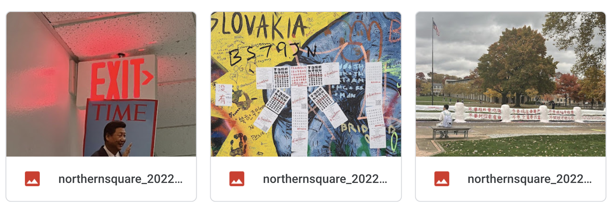
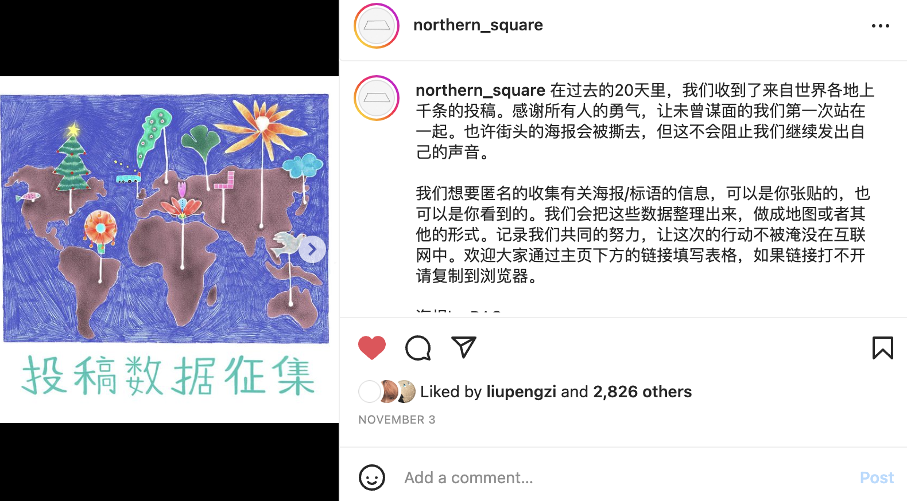
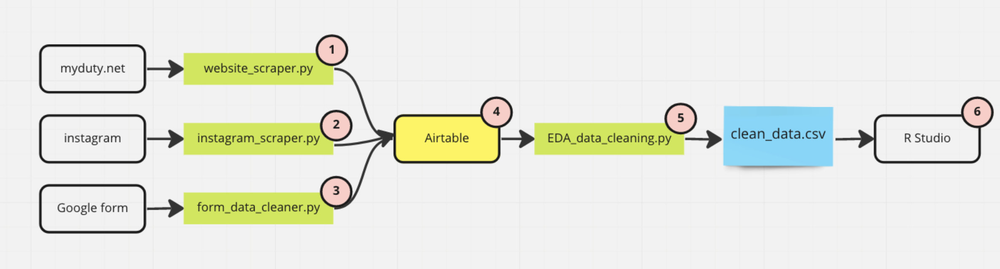

# Data 
## Background
On Oct. 13, days before China's 20th Communist Party Congress, a protester unfurled two banners on a highway overpass in central Beijing denouncing Xi Jinping as a “despotic traitor.” The action inspired a young generation of Chinese diaspora to express their anger by putting up anti-Xi and anti-dictatorship posters around the world. The action is remarkable since for those who grow up under authoritarian rule, expressing dissents in online space might not be new, but extending their expression into the physical space around them requires overcoming intense paranoia, self-censorship, and indoctrination. 

## Sources
### Instagram pages
The phenomenon of overseas Chinese protestors using Instagram to distribute information and organize protests is well documented in mainstream media ([Wired](Instagram accounts that have been considered central information hubs for the protest) and [NYTimes](https://www.nytimes.com/2022/10/24/business/xi-jinping-protests.html)). Most notably, [@northern_square](https://www.instagram.com/northern_square/) and [@citizendailycn](https://www.instagram.com/citizensdailycn/?hl=en) can be pinpointed as the central hub of information. In an interview with Wired, Bei, a New York based artist who manages [@northern_square](https://www.instagram.com/northern_square/) described that his followers would put up the same slogan in their cities in solidarity with the Sitong Bridge protester, and then submitting the pictures to Bei. During the height of the movement, he would receive hundreds of submissions a day.

To collect information shared by those two accounts, I first convert their Instagram pages into `JSON` format by adding the query string `?__a=1&__d=dis` to their Instagram profile's `HTML` address. Then the `JSON` can be downloaded to a local file, which I parsed using `scripts/instagram_scraper.py`.

The results scraped from the Instagram pages only includes the image themselves and the post caption, and does not include any information with regard to who submitted the image or where the picture was taken. However, due to the curated nature of the post, this dataset includes some of the most compelling graphics -

```{r}

```

### Community Maintained Website
[myduty.net](myduty.net) is a spin off of [@citizendailycn](https://www.instagram.com/citizensdailycn/?hl=en), built and maintained by community members, which collects and displays poster sightings from anonymous submissions. I built a simple scraper `scripts/website_scraper.py` using python's `BeautifulSoup` package.

The results scrapped from the website does not include information about the submitter, but does include the location of the poster. 

### Goolge Form
A Google form is distributed to followers of [@northern_square](https://www.instagram.com/northern_square/) to submit sightings of poster or their own posters, which collects both pictures of the poster and a brief survey on submitter demographics. The form is also distributed in protesters' Telegram groups, which is then passed through `scripts/form_data_cleaner.py` for basic data cleaning.

```{r, fig.cap = "@northern_square calling for followers to submit their posters through Google form"}

```


## Cleaning / transformation
```{r}

```


## Missing value analysis

