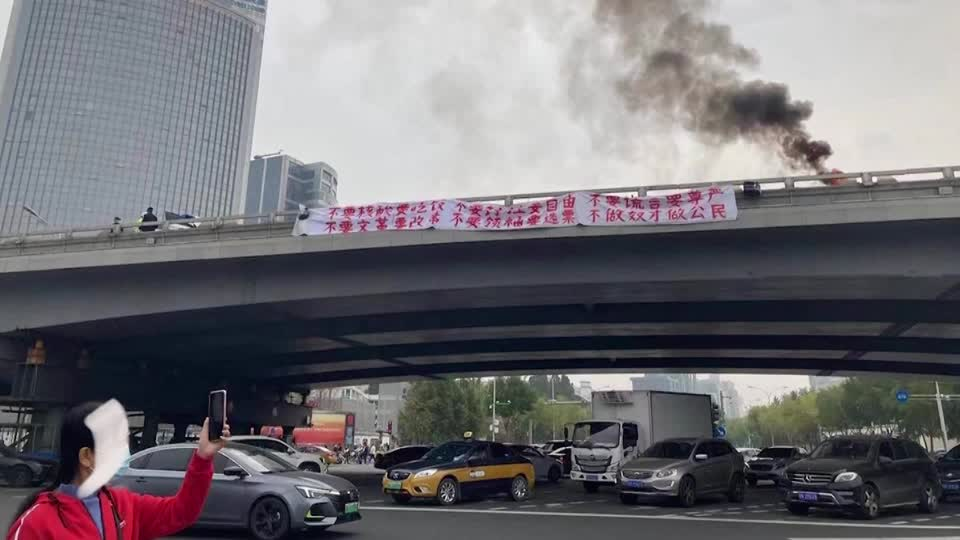

--- 
title: "A Visual Study of the 2022 Poster Movement of Chinese Diaspora"
author: "Siyu Yang"
date: "`r Sys.Date()`"
site: bookdown::bookdown_site
---

# Introduction

```{r}

```

On Oct. 13, days before China's 20th Communist Party Congress, a protester unfurled two banners on a highway overpass in central Beijing denouncing Xi Jinping as a “despotic traitor.” The action inspired a young generation of Chinese diaspora to express their anger by putting up anti-Xi and anti-dictatorship posters, many echoing the message expressed on the Sitong Bridge banner: 

> We don't want relentless nucleic acid testing, we want food to eat;
> 
> We don't want lockdowns, we want freedom;
> 
> We don't want lies, we want dignity;
> 
> We don't want a repeat of Cultural Revolution, we want political reform;
> 
> We don't want dictators, we want elections;
> 
> We don't want to be slaves, we want to be citizens.

The action is remarkable since for those who grow up under authoritarian rule, expressing dissents in online space might not be new, but extending their expression into the physical space around them requires overcoming intense paranoia, self-censorship, and indoctrination. 

For this project, I hope to explore the poster movement by visualizing images of poster sightings, and attempt to study the below considerations:

- What are the messages on the poster? Are they only expressing discontent on China's zero-COVID policy, or going as far as calling for a regime change?
- What does the geologic spread tell us about the movement? Many observers and reporters already picked up that the poster movement is led by young Chinese overseas students - are some regions over or under represented than others? 
- How did the movement react to the 20th Communist Party Congress news cycle? Does the data align with the observation that there is a spike in action after Xi declared a third term?