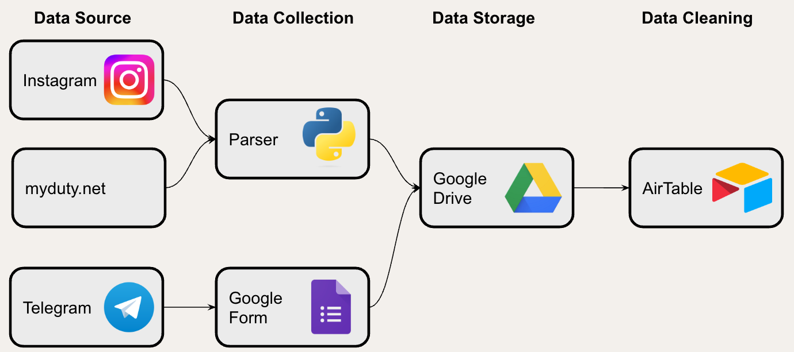
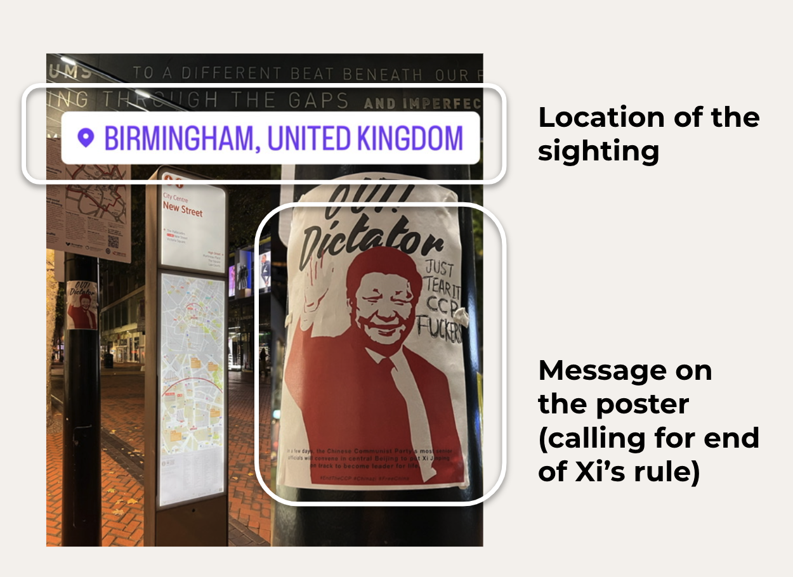

# Proposal

## Research topic

On Oct. 13, days before China's 20th Communist Party Congress, a protester unfurled two banners on a highway overpass in central Beijing denouncing Xi Jinping as a “despotic traitor.” The action inspired a young generation of Chinese diaspora to express their anger by putting up anti-Xi and anti-dictatorship posters. The action is remarkable since for those who grow up under authoritarian rule, expressing dissents in online space might not be new, but extending their expression into the physical space around them requires overcoming intense paranoia, self-censorship, and indoctrination. 

For this project, I hope to explore the poster movement by visualizing pictures of poster sightings, and attempt to answer the below questions -
- What is the message on the poster? Are they only expressing discontent on China's zero-COVID policy, or going as far as calling for a regime change?
- What does the geologic spread tell us about the movement? Many observers and reporters already picked up that the poster movement is led by young Chinese overseas students - are some regions over or under represented than others? 
- How does the movement react to the 20th Communist Party Congress news cycle? Does the data align with the observation that there is a spike in action after Xi declared a third term?

## Data Collection

The poster movement, as many recent grassroot movements under authoritarian regimes, are organized under the decentralization doctrine, dubbed by Hong Kong protestors as "无大台" -- "No central stage". Without central organizers or leading platforms, information are passed through a collection of often anonymous nodes, each node serving very specific purpose, causing data to be relatively scattered. 

### Data Avaliability
In the spirit of limiting research scope, I will be looking at the below three sources:
- Instagram page [@northern_square](https://www.instagram.com/northern_square/) and [@citizendailycn](https://www.instagram.com/citizensdailycn/?hl=en) - actively maintained central distributors that posts poster sightings using Instagram's "story" feature and "post" feature
- [myduty.net](myduty.net)  - community maintained website that collects and displays poster sightings from anonymous submission
- Telegram Groups - Telegram is an encrypted instant messaging application favored by organizers across the world; many groups spun up in reaction to the poster movement


### Data collection Methods
Due to the distributed nature of the dataset, I will be using two methods for data collection.  
- Scraping - I will be building a scraper to collect all public posts by @northern_square and @citizendailycn, and all public submissions on [myduty.net](myduty.net) 
- Surveying - I have distributed a [google form](https://forms.gle/EMAsYP5kapgbz44u7) through Telegram groups and Instagram DMs, and have collected 140 entries as of November 1st, 2022
As described in the visualization below, the parser will be collecting data from the two instagram pages, as well as myduty.net, and the Google Form will be collecting data from Telegram channels. Data will be stored in a Google Drive, which is loaded into AirTable for tagging and cleaning.

```{r}

```

#### Data Points to be Collected
- Image of the poster sighting
- Location of the poster sighting
- Message on the poster
- Basic demographics of participants (only for survey submissions)

```{r}

```

### Scraping Ethics and Safety Considerations 
#### Safety 
- I will be manually removing any personally identifiable information or information that may pose a risk to the submitter or the poster creator, including but not limited to image EXID, uncovered faces, names, etc.
- I will not be distributing the Google form in Wechat or any social media platform monitored by Chinese government entities.
- I will use my discretion to collect and store submission from individuals currently still residing in Chinese jurisdiction.
	
#### Consent
- I will only be collecting data with either expressed consent for permanent storage, or is already stored in publicly available forums. The Google Form I distributed has explicit terms requesting consent for storage. [myduty.net](myduty.net) only collects user submitted data, and we can infer data scraped from the website are provided by users consenting to making the image permanently avaliable online.
- @northern_square and @citizendailycn also collects user submitted data, but some submissions are displayed in "post" format, which is permanently available, and some in "story" format, which will be automatically deleted in 24 hours. I will not be scraping submissions displayed in the "story" format.

### Data Quality Considerations	- Data Bias
- All three data collection measures are heavily susceptible to collection biases. 
	- The two Instagram pages are manually maintained by community members, so I will be expecting more active posting behaviors around news events
	- The survey is distributed manually by me, and I am expecting a recency bias between the time I share the survey in Telegram chat groups and the time people submit their poster sightings
- Data Quality
	- Since all submissions are manual free text, I am expecting the heavy lifting to be around data cleaning and data tagging 


